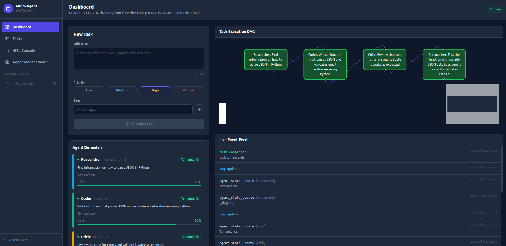

# 

# Multi-Agent Platform (MAP)
MindMesh is a production-grade, full-stack Multi-Agent AI Platform built on 7 architectural pillars and a healthy amount of optimism. It turns complex objectives into a coordinated dance (or a polite mosh pit) of specialized agents.


📸 Sightseeing (UI Preview)
# 

---

## Architecture Overview

```
┌─────────────────────────────────────────────────────────────────┐
│                        Next.js Frontend                         │
│  ┌──────────────┐  ┌──────────────────┐  ┌──────────────────┐  │
│  │  Command     │  │  Real-Time DAG   │  │  HITL Console    │  │
│  │  Center      │  │  Dashboard       │  │  (Review Queue)  │  │
│  └──────┬───────┘  └────────┬─────────┘  └────────┬─────────┘  │
│         │  REST API         │  WebSocket           │  REST API  │
└─────────┼───────────────────┼──────────────────────┼────────────┘
          ▼                   ▼                      ▼
┌─────────────────────────────────────────────────────────────────┐
│                   FastAPI Orchestrator (Backend)                 │
│  ┌──────────────┐  ┌──────────────────┐  ┌──────────────────┐  │
│  │  Task Router │  │  DAG Engine      │  │  HITL Gate       │  │
│  │  & Scheduler │  │  (networkx)      │  │  (Review Queue)  │  │
│  └──────┬───────┘  └────────┬─────────┘  └──────────────────┘  │
└─────────┼───────────────────┼────────────────────────────────────┘
          ▼                   ▼
┌─────────────────────────────────────────────────────────────────┐
│                   Redis Streams (Message Bus)                    │
│            Pub/Sub channels per agent type                      │
└─────────┬───────────────────────────────────────────────────────┘
          ▼
┌─────────────────────────────────────────────────────────────────┐
│                      Agent Pool                                  │
│  ┌──────────┐ ┌──────────┐ ┌──────────┐ ┌──────────────────┐  │
│  │ Planner  │ │Researcher│ │  Coder   │ │     Critic       │  │
│  └────┬─────┘ └────┬─────┘ └────┬─────┘ └────────┬─────────┘  │
└───────┼─────────────┼────────────┼─────────────────┼────────────┘
        ▼             ▼            ▼                 ▼
┌─────────────────────────────────────────────────────────────────┐
│              Hybrid Memory + Tool Registry                       │
│  ┌──────────────────┐       ┌──────────────────────────────┐    │
│  │  PostgreSQL       │       │  Qdrant (Vector DB)          │    │
│  │  (State / Audit) │       │  (Semantic Embeddings)       │    │
│  └──────────────────┘       └──────────────────────────────┘    │
│  ┌──────────────────────────────────────────────────────────┐    │
│  │  Tool Registry: WebSearch | CodeRunner | DBQuery         │    │
│  │  (Docker-sandboxed execution)                            │    │
│  └──────────────────────────────────────────────────────────┘    │
└─────────────────────────────────────────────────────────────────┘
```

---

## 7 Architectural Pillars

| # | Pillar | Implementation |
|---|--------|---------------|
| 1 | **Orchestration** | Central FastAPI orchestrator with DAG-based task routing via `networkx` |
| 2 | **Agent Pool** | `BaseAgent` → `PlannerAgent`, `ResearcherAgent`, `CoderAgent`, `CriticAgent` |
| 3 | **Hybrid Memory** | PostgreSQL (state/audit) + Qdrant (semantic vector search) |
| 4 | **Tool Registry** | Central registry with permission checks; code runs inside Docker containers |
| 5 | **Async Messaging** | Redis Streams — no direct agent-to-agent synchronous calls |
| 6 | **Observability + HITL** | Distributed tracing; Human Review Queue for low-confidence actions |
| 7 | **Frontend** | Next.js + Tailwind CSS + React Flow DAG + WebSocket streaming |

---

## Tech Stack

| Layer | Technology |
|-------|-----------|
| Backend | Python 3.11, FastAPI, SQLAlchemy 2.0, Alembic |
| Frontend | Next.js 14, React 18, Tailwind CSS, React Flow |
| Vector DB | Qdrant |
| Relational DB | PostgreSQL 16 |
| Message Bus | Redis 7 (Streams) |
| LLM | Ollama (local) / OpenAI-compatible API |
| Containerization | Docker, Docker Compose |
| Tracing | OpenTelemetry |

---

## Project Structure

```
multi_agent_platform/
├── backend/
│   ├── app/
│   │   ├── main.py                 # FastAPI entry point
│   │   ├── config.py               # Settings (pydantic-settings)
│   │   ├── models/                 # Pydantic + SQLAlchemy models
│   │   ├── orchestrator/           # DAG engine + task router
│   │   ├── agents/                 # BaseAgent + specialized agents
│   │   ├── memory/                 # PostgreSQL + Qdrant adapters
│   │   ├── tools/                  # Tool registry + sandboxed runners
│   │   ├── messaging/              # Redis Streams bus
│   │   ├── api/                    # REST routes + WebSocket
│   │   └── observability/          # Tracing + metrics
│   ├── Dockerfile
│   └── requirements.txt
├── frontend/
│   ├── src/
│   │   ├── app/                    # Next.js App Router pages
│   │   ├── components/             # UI components
│   │   ├── lib/                    # API client + WebSocket
│   │   └── hooks/                  # Custom React hooks
│   ├── Dockerfile
│   └── package.json
├── docker-compose.yml
├── .env.example
└── README.md
```

---

## Quick Start

### Prerequisites

- Docker & Docker Compose v2+
- (Optional) Ollama for local LLMs

### 1. Clone & Configure

```bash
git clone <repo-url>
cd multi_agent_platform
cp .env.example .env
# Edit .env with your values
```

### 2. Start the Stack

```bash
# Standard stack (OpenAI-compatible LLM)
docker compose up -d

# With local Ollama LLM
docker compose --profile local-llm up -d

# Pull a model into Ollama
docker compose exec ollama ollama pull mistral
```

### 3. Access the Platform

| Service | URL |
|---------|-----|
| Frontend | http://localhost:3000 |
| Backend API | http://localhost:8065 |
| API Docs | http://localhost:8065/docs |
| Qdrant UI | http://localhost:6333/dashboard |

---

## API Contracts

### Task Submission (REST POST /api/v1/tasks)

```json
{
  "objective": "Research and summarize the latest advancements in quantum computing",
  "priority": "high",
  "tags": ["research", "summarization"],
  "context": {}
}
```

### Task State (REST GET /api/v1/tasks/{task_id})

```json
{
  "task_id": "uuid",
  "status": "running",
  "dag_nodes": [
    {"id": "planner-1", "type": "planner", "status": "completed"},
    {"id": "researcher-1", "type": "researcher", "status": "running"},
    {"id": "critic-1", "type": "critic", "status": "pending"}
  ],
  "dag_edges": [["planner-1", "researcher-1"], ["researcher-1", "critic-1"]],
  "created_at": "2026-02-27T10:00:00Z",
  "updated_at": "2026-02-27T10:01:30Z"
}
```

### WebSocket Event (ws://localhost:8065/ws/{client_id})

```json
{
  "event": "agent_state_update",
  "task_id": "uuid",
  "agent_id": "researcher-1",
  "agent_type": "researcher",
  "status": "running",
  "message": "Querying web sources...",
  "confidence": 0.92,
  "timestamp": "2026-02-27T10:01:30Z"
}
```

### HITL Review Item (REST GET /api/v1/hitl/queue)

```json
{
  "review_id": "uuid",
  "task_id": "uuid",
  "agent_id": "coder-1",
  "action": "execute_code",
  "payload": {"code": "import os\nos.system('rm -rf /')"},
  "confidence": 0.31,
  "reason": "Potentially destructive code detected",
  "created_at": "2026-02-27T10:02:00Z"
}
```

---

## Development

### Backend only

```bash
cd backend
cp ../.env .env
uv sync
uv run uvicorn app.main:app --reload --port 8065
```

### Frontend only

```bash
cd frontend
npm install
npm run dev
```

---

## LLM Providers

The platform uses an **agnostic LLM wrapper**. Configure via `.env`:

| Provider | `LLM_PROVIDER` | `LLM_BASE_URL` | `LLM_MODEL` |
|----------|---------------|----------------|-------------|
| Ollama (local) | `ollama` | `http://ollama:11434` | `mistral` |
| OpenAI | `openai` | `https://api.openai.com/v1` | `gpt-4o` |
| Any OpenAI-compatible | `openai` | `<your-url>` | `<model>` |

---

## License
MIT — Feel free to use it, just don't blame us if the agents start a union.
